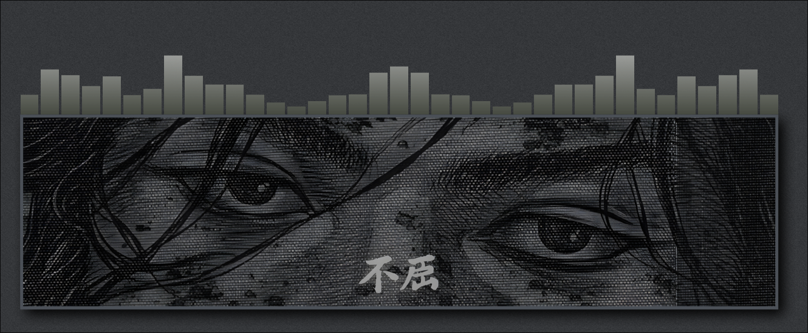

# DeskVis

A transparent desktop audio visualizer widget for Noctalia. Displays real-time audio spectrum with three visual modes and four growth directions, all symmetric around the center axis.

## Video Showcase

https://github.com/user-attachments/assets/d2d32185-24ca-4b10-8c0e-1be221d433ed

## Features

- **3 visualizer modes** — Bars, Mirror, Wave
- **4 directions** — Up, Down, Left, Right
- **Y-axis symmetric** — spectrum mirrors left↔right around the center
- **Per-instance settings** — each widget instance has its own independent configuration
- **Theme-aware** — follows your color scheme by default, with optional custom colors
- **Fade when idle** — optionally fades out when no audio is playing

## Requirements

- Noctalia v4.6.6 or later

## Settings

| Setting | Description | Default |
|---|---|---|
| Direction | Which way the visualizer grows | Up |
| Visualizer Mode | Bars, Mirror, or Wave | Bars |
| Bar Count | Number of bars (Bars/Mirror only) | 32 |
| Sensitivity | Audio input amplification | 1.5 |
| Smoothing | Bar decay speed (higher = slower) | 0.18 |
| Target FPS | Render frame rate | 60 |
| Custom Width | Override default width (0 = default) | 0 |
| Custom Height | Override default height (0 = default) | 0 |
| Color Gradient | Blend primary → secondary color | On |
| Fade When Idle | Fade out when no audio plays | On |
| Use Custom Colors | Override theme colors | Off |
| Primary Color | Custom primary color | #6750A4 |
| Secondary Color | Custom secondary color | #625B71 |
